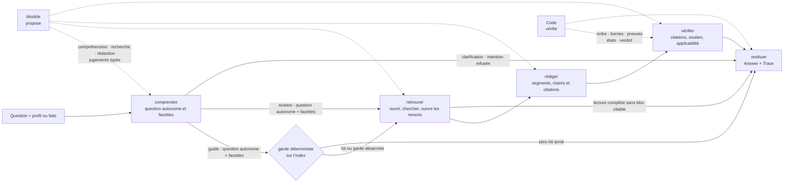
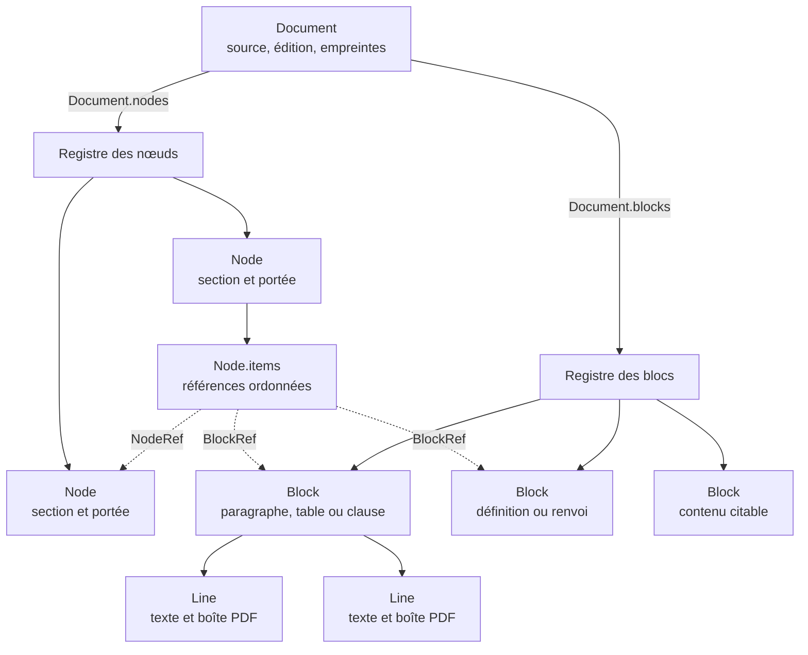
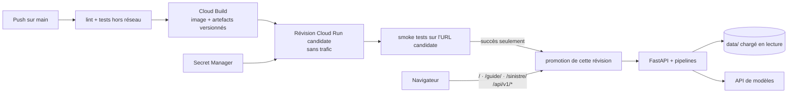

# L’architecture en deux pages

Foyer Retour n’est pas un agent libre de choisir ses outils et sa marche. C’est une chaîne de
montage à contrats typés : le modèle intervient à des endroits bornés, avec des contrôles autour,
et chaque étape rend un objet Pydantic à la suivante. La règle de lecture est simple :
**le modèle propose, le code vérifie**. Le premier apporte la souplesse de compréhension, de recherche et de rédaction ;
le second garde l’ordre, relit les preuves, calcule les états et rend tout **échec terminal** visible
(AD-1, AD-16).

## Une requête : cinq étapes, dans le même ordre

Une réponse factuelle suit, dans les deux outils, *comprendre → retrouver → rédiger → vérifier →
restituer*. `comprendre` produit une question autonome et ses facettes, ou court-circuite vers
*restituer* pour une clarification ou un refus d’intention. Dans le guide, un dictionnaire validé et
conforme aux empreintes peut armer un refus « zéro hit » avant *retrouver*, sauf si un périmètre
tronqué désarme ce pré-contrôle. Une lecture complète sans bloc citable produit ensuite un refus ;
une lecture tronquée ne prouve jamais cette absence. Aucune sortie factuelle rédigée n’atteint
*restituer* sans passer par *vérifier* (AD-1, AD-5).

La navigation par outils est la recherche par défaut ; une variante déterministe fournit le même
contrat de résultat et sert de baseline ou de repli borné. Changer la recherche ne crée donc pas un
second pipeline (AD-1).

Chaque sortie normale porte l’`Answer` et la `Trace` des seules étapes réellement parcourues ; un
échec terminal conserve la trace partielle dès que la chaîne a commencé (AD-10, AD-16).

Une réponse est découpée en affirmations et en citations. Le `ClaimStatus` porté par chaque
affirmation garde quatre champs distincts. `retrouvee` est la preuve, établie par le code, que chaque
citation existe bien dans le bloc. `pertinente` est un jugement sémantique typé proposé par le
contrôle `reason` : le passage soutient-il l’affirmation et répond-il à la question ? Pour un
sinistre, le modèle propose aussi des observations typées sur les clauses et les faits ; le code les
relit, résout les portées et en dérive `applicable`, qui vaut `oui`, `non` ou `humain`. Enfin,
`edition` est une métadonnée du document, distincte de ces contrôles, qui rappelle sa version sans la
faire passer pour actuelle. Il n’y a pas de score de confiance qui mélangerait ces questions
différentes (AD-3, AD-4).

La première preuve est mécanique : identifiant connu, bloc citable, citation assez longue, présence
exacte après normalisation et occurrence non ambiguë. Le passage affiché est ensuite relu dans le
corpus, jamais repris de la chaîne proposée par le modèle. Le contrôle `reason` groupé propose les
jugements sémantiques typés de pertinence et de soutien ; le code prouve la présence des citations,
écarte les sorties incohérentes, dérive l’applicabilité, calcule `found`, `complete` et le verdict,
puis conserve les rejets pour l’audit. Une citation manquante ne devient jamais une réponse moins
sourcée en silence (AD-3, AD-4, AD-6, AD-16).

## Un classeur à blocs pour les deux sujets

Le guide issu du site et les conditions générales issues de PDF ont des ingestions différentes,
mais deviennent le même classeur à blocs. `Document.blocks` est le registre du contenu ;
`Node.items` porte l’ordre de lecture ; chaque bloc appartient à exactement un nœud. Le moteur de
recherche, le validateur de citations et la trace travaillent ainsi sur une seule représentation
(AD-2).

Les **IDs stables** relient ingestion, serveur, citations, surlignage et questions-témoins. Un
`block_id` encode le document, la localisation et l’ordre dans cette localisation. Même source et
même empreinte d’ingestion donnent les mêmes identifiants ; une modification rend visibles les IDs
disparus au lieu de raccorder silencieusement une ancienne preuve à un nouveau texte (AD-2).

## Le verdict : une table conservatrice, pas une opinion du modèle

Pour un sinistre, le modèle extrait des observations typées sur les faits et les clauses. Le code
relit les fragments de faits, résout la portée des clauses, dérive `applicable`, puis parcourt cette
table dans l’ordre. Le verdict reste explicitement « au regard des conditions générales seules » :
il ne constitue ni une décision de garantie, ni une validation métier (AD-6).

| Priorité | État prouvé sur les clauses affichées | Verdict calculé |
| --- | --- | --- |
| 0 | contradiction non résolue, renvoi décisionnel ouvert ou aucune clause fondatrice | `ne_tranche_pas` |
| 1 | une exclusion applicable couvre le cas | `non_couvert` |
| 2 | une garantie s’applique, mais une condition, franchise ou exclusion reste humaine ; ou la garantie sort du socle commun ou dépend d’une option ou de conditions particulières inconnues | `sous_conditions` |
| 3 | une garantie du socle s’applique et aucune clause ne reste ouverte | `couvert` |
| 4 | aucun cas précédent ne tranche | `ne_tranche_pas` |

L’ordre compte : après les gardes de priorité 0 — contradiction, renvoi décisionnel ouvert ou
absence de clause fondatrice —, une exclusion applicable dont la portée couvre le cas prime. Une
option, une condition particulière ou une qualité factuelle inconnue garde la décision ouverte. Le
modèle ne produit jamais la valeur finale et n’effectue aucun calcul de couverture (AD-6).

## Intelligence payée à l’ingestion, lecture au service

L’**intelligence payée à l’ingestion** transforme les sources en artefacts versionnés. Pour la
structure PDF, le modèle propose seulement ancres `line_uid` et liens ; le code vérifie UID, ordre,
couverture et bornes avant d’appliquer `structure.json`. Un artefact refusé met le document en
quarantaine sans repli silencieux (AD-2, AD-7, AD-16).

Séparément, pour les clauses des PDF, le modèle d’ingestion étiquette les `block_id` avec un type et
une confiance, sans renvoyer leur texte ; le code résout l’arbre, les portées et les renvois. Les
contrôles statiques vont dans `report.json` et une incohérence bloquante garde le document hors du
corpus servi (AD-7, AD-8). Au démarrage, le serveur charge les JSON et leurs index en mémoire puis
les consulte sans les modifier.

`ingest` sert le hors-ligne ; `reason`, toutes les décisions servies. Sonnet au minimum pour tout choix sémantique :
compréhension, navigation/suffisance retrieval, rédaction et vérification.
`micro` reste expérimental. Les IDs de
modèles sont centralisés plutôt que promis par la documentation. Le préfixe stable du tier `reason`
utilise le cache fournisseur d’une heure ; séparément, le harness d’évals possède un cache persistant
indexé par le modèle, les paramètres, les schémas, le pipeline, le corpus, la variante et l’entrée
(AD-14). Une seule table de prix calcule le coût depuis l’usage réellement rendu par l’API (AD-9).

**Amendement R-11 — contrat de recherche v2.**

`Index.chercher` rend des `ScoredHit` immuables portant identités, titre complet, extrait borné et
score rationnel exact. Le tri finit par document, clause, résultat ; l’identité question ignore
l’ordre des groupes. `outils`, `deterministe` et `full_context` transportent le record sans recalcul
jusqu’à l’admission et la suffisance. Les `ContextUnit` voisins gardent leur rôle sans hériter de la
pertinence ; snapshots et admission partagent union dédupliquée et estimateur de tokens. Toute
nouvelle version exige tests des trois consommateurs et revue d’architecture.

## Un service, une origine, une promotion conditionnelle

FastAPI sert l’accueil, `/guide/`, `/sinistre/` et `/api/v1/*` depuis un seul service Cloud Run et
une seule origine. Le navigateur ne reçoit aucune clé fournisseur : `ANTHROPIC_API_KEY` vient de
Secret Manager et reste côté serveur. Le limiteur par instance, le plafond par requête et le nombre
maximal d’instances bornent la dépense de cette démonstration ; ils ne sont pas présentés comme une
protection de production (AD-12, AD-13).

Le workflow construit une révision sans trafic, sonde son URL taguée, puis nomme précisément cette
révision pour la promotion. Si un contrôle échoue, l’étape de promotion n’a pas lieu et le tag du
candidat est retiré. Cette topologie matérialise la même règle que le pipeline : un contrôle n’est
pas une note ajoutée après coup, c’est une frontière avant exposition (AD-12, AD-16).
